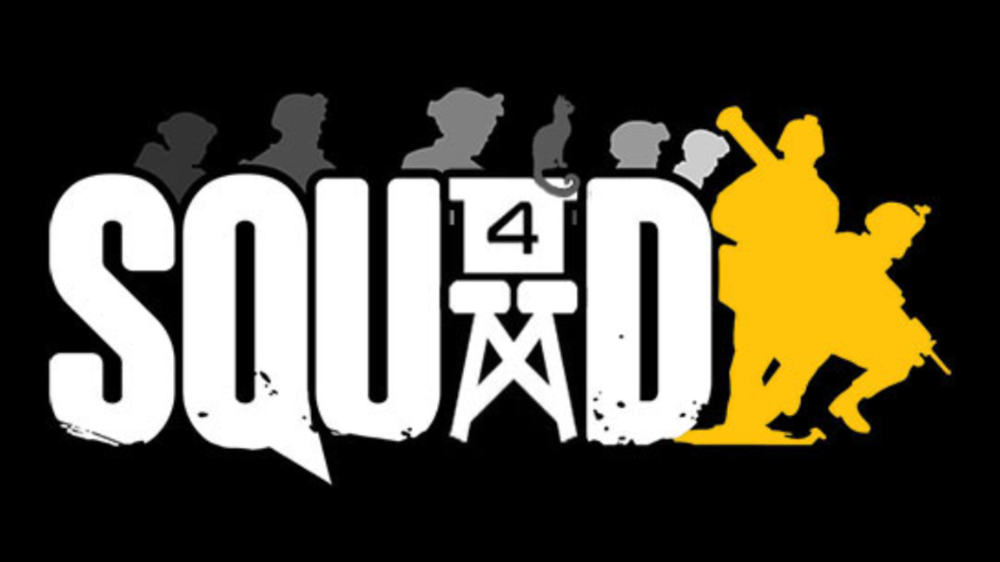

### KOTH Server Template
*A simplified template for rapidly deploying your own KOTH Server in Squad.*

---

 

 
### Overview
This example attempts to support most Third-Party KOTH mods from the creator community as possible. This is a generic template to get you up and running as fast as possible with KOTH after loading it on your server.

---

 

### Compatible Mod List
Content Packs:
Contractor's Crate 
https://steamcommunity.com/sharedfiles/filedetails/?id=3469480936

Gameplay Mods:
King of the Hill (KotH) Inventory Mod 
https://steamcommunity.com/sharedfiles/filedetails/?id=3481648267

Modded Layers:
King of the Hill - Additional Layers | [KOTH] (Alpha)
https://steamcommunity.com/sharedfiles/filedetails/?id=3476103791

Operation First Light: Re-Introduced [SQ v8.2] [Map] - [KOTH][ZEUS]
https://steamcommunity.com/sharedfiles/filedetails/?id=3309927178

Wil's Fools Road [SQ v8.2] [Map] - [KOTH][ZEUS] 
https://steamcommunity.com/sharedfiles/filedetails/?id=3040351557

Hrodna Border
https://steamcommunity.com/sharedfiles/filedetails/?id=3436010829
